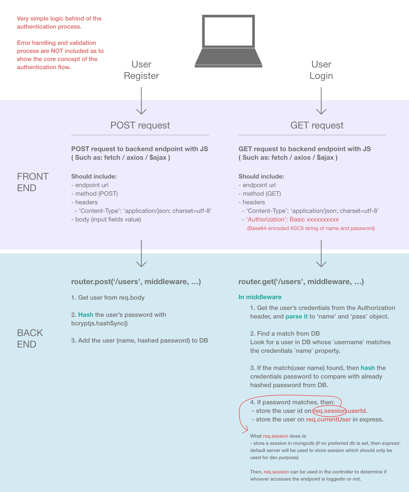

# react-authentication-with-express

Basic Authentication within a React client application, using an Express REST API.

__Note:__ This project originally followed [Treehouse's tutorial](https://teamtreehouse.com/library/react-authentication/introducing-the-authentication-project/what-is-basic-authentication).
However, the project was a bit outdated, and has some security vulnerabilities around protecting routes in the back-end, I have integrated express-session, react hooks and context api to make the code more robust and intuitive.(as of 2021 July)

Followed [User Authentication With Express and Mongo](https://teamtreehouse.com/library/user-authentication-with-express-and-mongo) tutorial to integrate express-session to the project.

## Getting Started

These instructions will get you a copy of the project up and running on your local machine for development and testing purposes. See deployment for notes on how to deploy the project on a live system.

### Prerequisites

Make sure you have installed all of the following prerequisites on your development machine:

- [Node.js](https://nodejs.org/en/download/)
- [Npm](https://www.npmjs.com/get-npm)
- [Nodemon](https://www.npmjs.com/package/nodemon)

### Built with

#### Main

- [React.js](https://www.npmjs.com/package/create-react-app) - Frontend
- [Express.js](https://www.npmjs.com/package/express) - Backend

#### Key packages

- [express-session](https://www.npmjs.com/package/express-session)
- [express-validator](https://www.npmjs.com/package/express-validator)
- [bcrypt.js](https://www.npmjs.com/package/bcryptjs)
- [basic-auth](https://www.npmjs.com/package/basic-auth)

### Installing a project

Clone a project to your local (cd /your_directory)

```
git clone https://github.com/Motoki-Higa/react-authentication-with-express.git
```

To install dependencies, run this in the application folder from the command-line:

```
npm install
```

### Start a project

Frontend and Backend need to run separately.

__FE__
cd into 'client' folder. Then run below.

```
npm start
```

__BE__
cd into 'api' folder. Then run below.

```
npm run start
```

### Authentication flow concept

